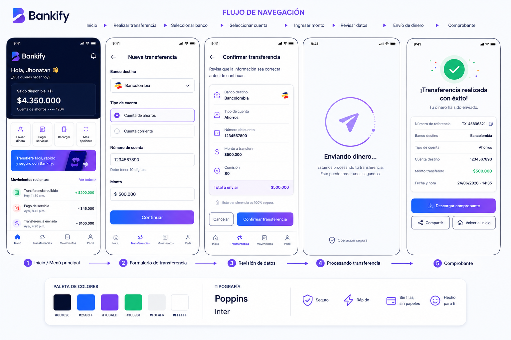

| FUNCIONALES (mínimo 5)                                                                                                                                                                                                                                                                                                                           | NO FUNCIONALES (mínimo 5)                                                                                                                                                                                                                                                                                                                     |
|--------------------------------------------------------------------------------------------------------------------------------------------------------------------------------------------------------------------------------------------------------------------------------------------------------------------------------------------------|-----------------------------------------------------------------------------------------------------------------------------------------------------------------------------------------------------------------------------------------------------------------------------------------------------------------------------------------------|
| RF:  Autenticar usuarios con usuario y contraseña   RF:  Registrar y validar cuentas bancarias (10 dígitos,banco registrado)   RF:  Consultar el saldo de una cuenta por el cliente   RF:  Realizar depósitos a una cuenta    RF:  Generar reporte tributario en PDF para el cliente   RF:  Enviar reporte a la DIAN en formato JSON |RNF: Seguridad: autenticación con tokens JWT   RNF: Disponibilidad: 99.5% uptime mensual   RNF: Rendimiento: respuesta < 2 segundos por operación   RNF: Escalabilidad: soportar 10.000 usuarios concurrentes   RNF: Auditabilidad: log de todas las transacciones 
| RF: crear clientes| RNF: El servicio debe estar operativo las 24 horas del día, los 7 días de la semana, salvo mantenimientos programados.
|RF: activar clientes | RNF: la aplicación debe cumplir con estándares de accesibilidad para que pueda ser utilizada por personas con discapacidades visuales o motoras.
|RF: Consultar Movimientos  | RNF: Ser compatible con diferentes sietemas operativos y navegadores web modernos.
|RF: Recibir notificaciones | RNF: RNF: El sistema debe poder restaurar la información y continuar operando después de una falla crítica.         
| RF: Realizar pagos de servicios  | RNF: las actualizaciones del sistema no deben afectar el funcionamiento de las funciones existentes.

# Detallar los 3 requerimientos

## RF01 – Autenticación con usuario y contraseña

### Descripción detallada

El sistema debe permitir que operadores y clientes accedan a la plataforma mediante un nombre de usuario y una contraseña válidos, garantizando que únicamente usuarios registrados puedan utilizar las funcionalidades del sistema.

### Actores involucrados

* Cliente
* Operador

### Precondiciones

* El usuario debe estar registrado en el sistema.
* La cuenta del usuario debe estar activa.
* El usuario debe conocer sus credenciales de acceso.

### Flujo principal

1. El usuario accede a la pantalla de inicio de sesión.
2. El sistema solicita nombre de usuario y contraseña.
3. El usuario ingresa sus credenciales.
4. El sistema valida la información suministrada.
5. El sistema autentica al usuario.
6. El sistema muestra la interfaz principal correspondiente al rol del usuario.

### Flujos alternativos

#### A1. Credenciales incorrectas

1. El usuario ingresa información inválida.
2. El sistema rechaza el acceso.
3. El sistema muestra un mensaje indicando que las credenciales son incorrectas.

#### A2. Cuenta inactiva

1. El usuario intenta iniciar sesión.
2. El sistema detecta que la cuenta se encuentra inactiva.
3. El acceso es denegado.

### Postcondiciones

* El usuario autenticado inicia una sesión válida en el sistema.
* Se registra el acceso realizado.

### Criterios de aceptación

* El sistema debe permitir el acceso únicamente a usuarios registrados.
* El sistema debe rechazar credenciales incorrectas.
* El sistema debe impedir el acceso a usuarios inactivos.
* El tiempo de respuesta debe ser menor a 2 segundos.

## RF02 – Consulta de saldo de una cuenta

### Descripción detallada

El sistema debe permitir a un cliente consultar el saldo disponible de una cuenta bancaria registrada y activa.

### Actores involucrados

* Cliente

### Precondiciones

* El cliente debe haber iniciado sesión.
* La cuenta debe existir en el sistema.
* La cuenta debe encontrarse activa.

### Flujo principal

1. El cliente selecciona la opción "Consultar saldo".
2. El sistema solicita la cuenta a consultar.
3. El cliente selecciona una cuenta registrada.
4. El sistema verifica la existencia y estado de la cuenta.
5. El sistema obtiene el saldo actual.
6. El sistema muestra el saldo disponible al cliente.

### Flujos alternativos

#### A1. Cuenta inexistente

1. El sistema detecta que la cuenta no existe.
2. Se muestra un mensaje de error.

#### A2. Cuenta inactiva

1. El sistema verifica que la cuenta está inactiva.
2. El sistema impide la consulta.
3. Se informa al usuario sobre la situación.

### Postcondiciones

* El saldo de la cuenta es mostrado al cliente.
* La consulta queda registrada en el sistema.

### Criterios de aceptación

* Solo un cliente autenticado puede consultar saldos.
* La cuenta debe existir y estar activa.
* El sistema debe mostrar el saldo actualizado.
* La operación debe completarse en menos de 2 segundos.

## RF03 – Depósito a una cuenta

### Descripción detallada

El sistema debe permitir realizar depósitos a una cuenta bancaria registrada, incrementando el saldo disponible de manera segura y registrando la transacción efectuada.

### Actores involucrados

* Cliente propietario
* Otros usuarios autorizados

### Precondiciones

* El usuario debe haber iniciado sesión.
* La cuenta destino debe existir.
* La cuenta debe estar activa.
* El monto del depósito debe ser mayor que cero.

### Flujo principal

1. El usuario selecciona la opción "Depositar dinero".
2. El sistema solicita la cuenta destino y el monto.
3. El usuario ingresa la información requerida.
4. El sistema valida la existencia de la cuenta.
5. El sistema verifica que la cuenta esté activa.
6. El sistema registra la transacción.
7. El sistema actualiza el saldo de la cuenta.
8. El sistema confirma que el depósito fue realizado con éxito.

### Flujos alternativos

#### A1. Cuenta inexistente

1. El sistema detecta que la cuenta no está registrada.
2. El depósito es cancelado.
3. Se muestra un mensaje de error.

#### A2. Cuenta inactiva

1. El sistema detecta que la cuenta está inactiva.
2. El depósito no se realiza.
3. Se informa al usuario.

#### A3. Monto inválido

1. El usuario ingresa un valor menor o igual a cero.
2. El sistema rechaza la operación.
3. Se solicita ingresar un monto válido.

### Postcondiciones

* El saldo de la cuenta es actualizado.
* La transacción queda registrada para auditoría.
* El usuario recibe una confirmación del depósito realizado.

### Criterios de aceptación

* El depósito solo debe realizarse sobre cuentas existentes y activas.
* El monto ingresado debe ser mayor a cero.
* El saldo de la cuenta debe actualizarse correctamente.
* La operación debe registrarse para fines de auditoría.
* El tiempo de respuesta debe ser inferior a 2 segundos.

# PREGUNTA DE ANÁLISIS
a. ¿Identifica algún requerimiento que deba detallarse más? ¿Cuál(es)? ¿Por qué?

Sí. Algunos requerimientos necesitan más detalle para evitar ambigüedades:

- RF: Recibir notificaciones, porque no especifica si serán por correo electrónico, SMS o notificaciones dentro de la aplicación.

- RF: Consultar movimientos, porque no indica si existe un límite de fechas, filtros o cantidad máxima de registros.

- RNF: Recuperar la información después de una falla crítica, porque no define el tiempo máximo permitido para la recuperación ni la cantidad de datos que podrían perderse.

b. ¿Existen requerimientos que se contradigan entre sí? ¿Cuáles?

No se observan contradicciones directas entre los requerimientos. Sin embargo, existe una posible redundancia entre:

- RNF: Disponibilidad del 99.5% de uptime mensual.
- RNF: El servicio debe estar operativo las 24 horas del día, los 7 días de la semana, salvo mantenimientos programados.

Ambos hacen referencia a la disponibilidad del sistema y podrían unificarse en un solo requerimiento para evitar duplicidad.

c. Si tuviera que dar prioridad, ¿cuáles serían los 2 más importantes para una primera iteración? Justifique.
- RF: Autenticar usuarios con usuario y contraseña.

Es fundamental para garantizar que solo los clientes autorizados puedan acceder a sus cuentas y realizar operaciones.
- RF: Consultar el saldo de una cuenta por el cliente.

Es una de las funciones principales que esperan los usuarios de una aplicación bancaria y aporta valor desde las primeras versiones del sistema.

d. ¿Existe algún requerimiento que NO debería realizarse en el MVP? ¿Por qué?

Sí. RF: Generar reporte tributario en PDF para el cliente y RF: Enviar reporte a la DIAN en formato JSON podrían dejarse para una fase posterior. Estas funcionalidades son especializadas y no son esenciales para que el usuario pueda utilizar las funciones básicas del banco, como iniciar sesión, consultar su saldo o realizar transacciones. Implementarlas después permitiría lanzar un MVP más rápido y enfocado en las necesidades principales.

## mockup y flujo de navegación Deposito a una cuenta 

