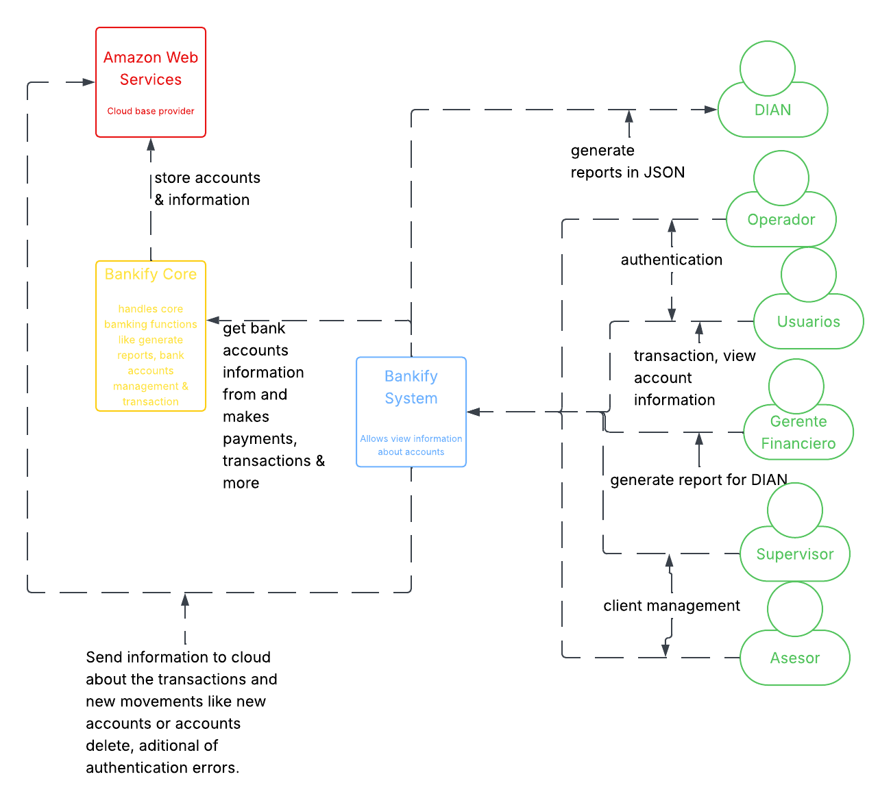

| **Sección**        | **Contenido a diligenciar**                                                                                                                                                                                                                                                                                                                                             |
|--------------------|:------------------------------------------------------------------------------------------------------------------------------------------------------------------------------------------------------------------------------------------------------------------------------------------------------------------------------------------------------------------------|
| **Sistema**          | Bankify                                                                                                                                                                                                                                                                                                                                                                 |
| **Problema a resolver** | Actualmente el sistema de Bankify presenta varias problemáticas, entre ellas se encuentran:   1. No tiene una validación de las cuentas bancarias.   2.No cuenta con un sistema de consulta de saldos.   3. No controla los depósitos   4. No genera reportes tributarios en PDF a los clientes   5.No hace envíos de reportes a la DIAN en formato JSON |
| **Diagrama de contexto** |      link:   https://lucid.app/lucidchart/671c9d0d-b392-4d19-9bec-46cacbff8f9b/edit?viewport_loc=-875%2C163%2C1697%2C866%2C0_0&invitationId=inv_77e9aa54-5045-4380-85cf-4ac826e4d93f                                                                                                                                            |
| **Alcance del sistema** | Teniendo en cuanta las problemáticas que presenta actualmente Bankify, el quipo de desarrollo DOWS Company busca brindar una solución eficiente, la cual logre satisfacer el objetivo del MVP. "Validar el modelo de negocio con funcionalidades esenciales antes de escalar".                                                                                          |

